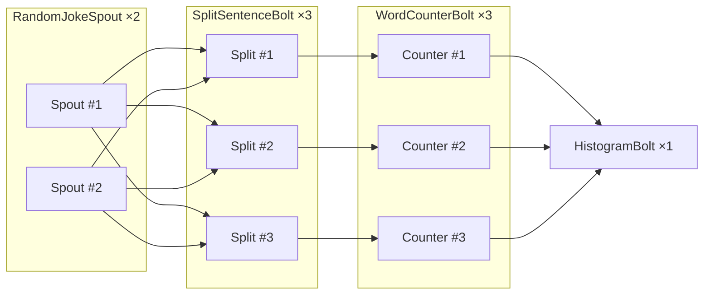

# apache-storm-starter

Everything you need to prototype Apache Storm topologies quickly: a Gradle build, a ready-to-use devcontainer, and a joke-driven word count example that proves the toolchain end to end.

## Example topology
- `RandomJokeSpout` (2 executors) reads the bundled `jokes.json` dataset and emits random jokes (id, category, rating, body).
- `SplitSentenceBolt` (3 executors) tokenizes each joke body into lowercase words.
- `WordCounterBolt` (3 executors) maintains per-word counters and emits the running total.
- `HistogramBolt` (single executor) collects the counts into a global histogram and writes a timestamped snapshot to `data/histogram.txt` every 5 seconds.

`WordCountTopology` wires these components with shuffle and fields groupings and, in local mode, keeps the embedded Storm cluster alive for about one minute so you have time to inspect the output. Production mode can be toggled via the `STORM_PROD` environment variable or the `-Dstorm.prod` system property (both default to `false`).

## Topology diagram


Dataset source: <https://github.com/taivop/joke-dataset/blob/master/stupidstuff.json>

## Run it locally
1. From the repo root run `./gradlew run`.
2. Watch the console logs; each spout/bolt uses SLF4J to report the tuples it processes.
3. Open `data/histogram.txt` while the topology is running (or right after shutdown) to see the aggregated word frequencies.

Tip: remove `data/histogram.txt` between runs if you prefer a clean snapshot.

Need to submit directly from the Gradle task? Use `STORM_PROD=true ./gradlew run`, `./gradlew run -Dstorm.prod=true`, or pass an explicit flag with `./gradlew run --args='--prod'` so the topology is submitted to Nimbus instead of the embedded LocalCluster.

## Devcontainer tasks
- `task devcontainer`: build, start, and attach to the devcontainer (runs build → up → attach).
- `task devcontainer-recreate`: force a teardown and rebuild from scratch.
- `task devcontainer-build`: build only.
- `task devcontainer-up`: start or reuse the container.
- `task devcontainer-attach`: exec into the container and attach to the tmux session.
- `task devcontainer-down`: stop and remove the container plus its volumes.

## Submit to a remote Storm cluster
1. Toggle production mode at runtime by exporting `STORM_PROD=true` **or** passing `-Dstorm.prod=true` when invoking the JVM/Gradle task (no code changes needed).
2. Build the fat jar: `./gradlew clean jar`. The artifact lands in `build/libs/apache-storm-starter.jar`, bundles your application dependencies, and relies on the Storm runtime provided by the cluster (Storm jars stay external to avoid resource clashes).
3. Enter the devcontainer (`task devcontainer` or `task devcontainer-attach`). It already ships with a Storm CLI configured via `/root/storm.yaml`, including Nimbus and ZooKeeper endpoints, so no extra flags are required.
4. Submit the topology from inside the container (remember to enable production mode, e.g. `STORM_PROD=true`):
   ```bash
   STORM_PROD=true storm jar build/libs/apache-storm-starter.jar \
     org.apache.storm.example.WordCountTopology \
     WordCountTopology
   ```
   Replace the last argument if you want a different topology name.
5. Monitor the deployment through the Storm UI (`http://<nimbus-host>:8080`) or the CLI (`storm list`). When you're done, stop it with `storm kill WordCountTopology` (or your chosen name).

If you need to submit from outside the devcontainer, copy both `build/libs/apache-storm-starter.jar` and the provided `conf/storm.yaml` to the target machine and adjust the hostnames to match your cluster.
